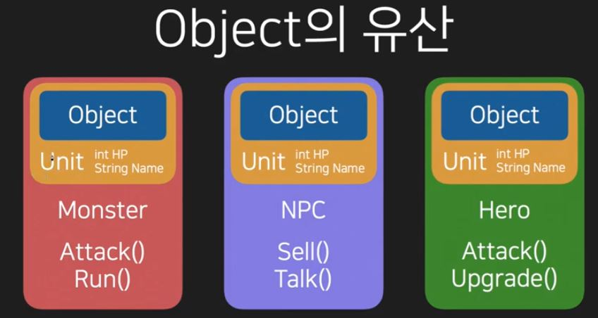
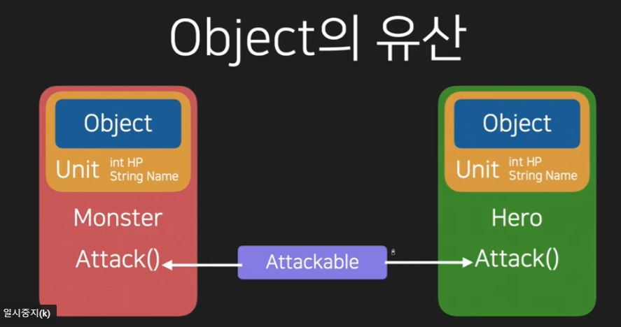
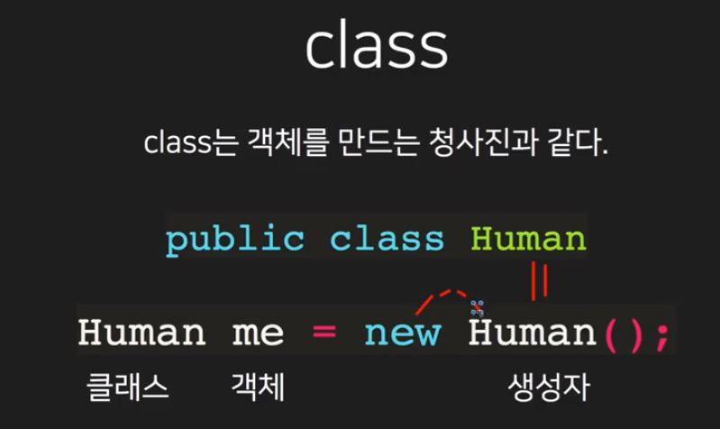
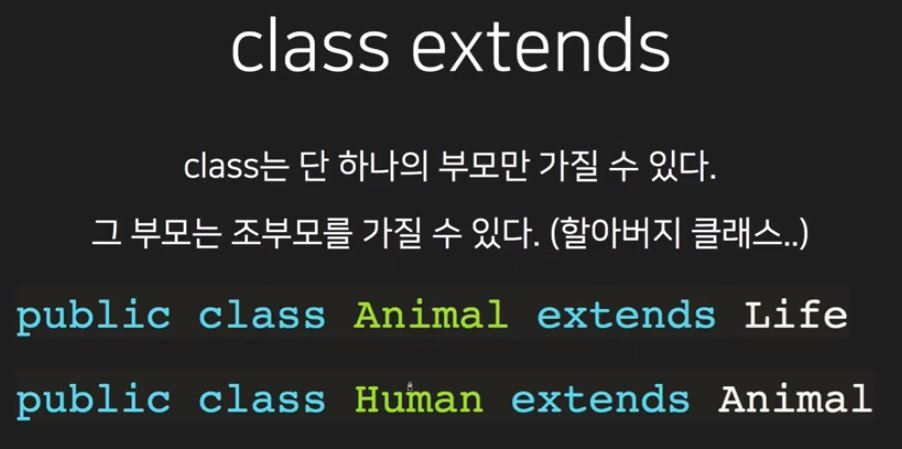
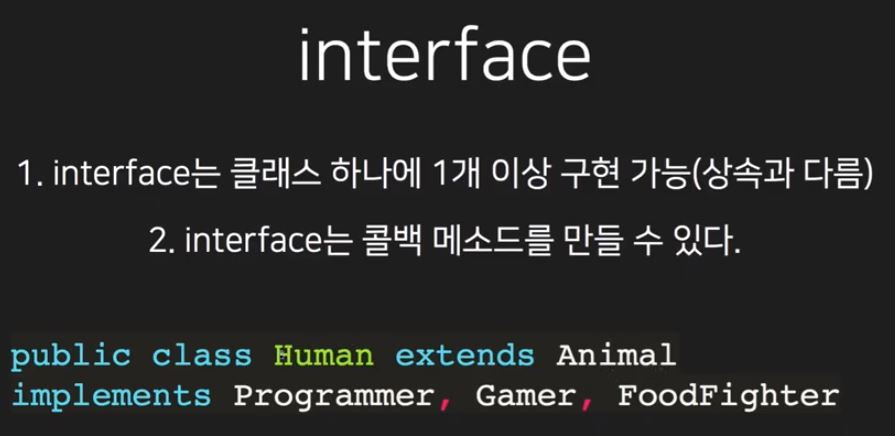

# 190528 JAVA 2강

#### java 객체지향

A. Object - Oreiented Programming 줄여서 OOP

B. 제일 중요한건 '객체(Object)'

C. 객체는 정보(변수)와 행동(메소드)를 가진다.

* C 언어와 자바는 객체지향인지 아닌지의 차이 

```java
class Player{
    String name = "Ciri";
    Color hairColor;
    
    int height;
    int weight;
    
    void Walk()
    int Attack()
    void Talk()
    
    class Color{
        int r;
        int g;
        int b;
    }
}
```

```java
public class HelloWorld{
    
    static class Player {
        
        String name;
        int hp;
        int atk;
        
        public Player(String name, int hp, int atk) {
            this.name = name;
            this.hp = hp;
            this.atk = atk;
        }
        public void attack(Enemy enemy) {
            System.out.print(" Player Attack!");
            enemy.hp -= this.atk;
            System.out.print(" Enemy hp : " + enemy.hp);
        }
        public boolean isLive() {
            if (hp <= 0) {
                return false;
            }
            else {
                return true;
            }
        }
    }
    
    static class Enemy {
        String name;
        int hp;
        int atk;
        
        public Enemy(String name, int hp, int atk) {
            this.name = name;
            this.hp = hp;
            this.atk = atk;
        }
        public void attack(Player player) {
            System.out.print(" Enemy Attack!");
            player.hp -= this.atk;
            System.out.print(" Player hp : " + player.hp);
        }
        public boolean isLive() {
            if (hp <= 0) {
                return false;
            }
            else {
                return true;
            }
        }
    }

    public static void main(String []args){
        
        Player player = new Player("gamepari", 100, 12);
        Enemy enemy = new Enemy("Orc", 80, 5);
        
        while(player.isLive() && enemy.isLive()) {
            player.attack(enemy);
            if (!enemy.isLive()) break;
            enemy.attack(player);
        }
        
        if (player.isLive()) {
            System.out.print(" player win!");
        }
        else {
            System.out.print(" enemy win!");
        }
        
        
      
     }
}

```


### java 상속

A. 클래스는 부모와 자식관계를 가질 수 있다.

B. 자식 클래스는 부모 클래스가 물려준 재산을 상속받는다.

C. 항상 하나만 상속 받을 수 있음



### java 예외처리

```java
try{
    Method1();
}
catch (Exception e){
    showAlert(e.getMessage());
}
------------------------------------------------------
void Method() throws Exception{
    if(isInternetOff){
        throw new Exception("인터넷안됨");
    }
    else if (isWrongInput){
        throw new Exception("잘못된 입력");
    }
}

String msg = "잘지내?";

try {
    SendMessage(msg);
}
catch (NetworkException e){
    AddSchedule(msg);
}
```

try catch 사용하는 이유

예측할수없는 상황이 됐을때 대처하는 제안을 제시 

### java interface 파트1

A. java에서는 2개 이상의 상속이 불가능하다.

B. '상속' 대신 '구현' 하자.

C. 뭐로? 인터페이스로 ^ㅅ^



* extends, 상속은 아이덴티티를 보유한다 ex) 개는 동물이다.
* implements, 구현은 역할을 부여한다. ex) 개는 애완동물이다.
* 구현은 변수를 상속받지 않는다.

###  java interface 파트2

call back

* 시점에 호출되는 메서드를 callback이라고 함.

* 보통 onClick, onTouch,onPressed등 on~이 붙는다.
* 콜백을 정의한 인터페이스는 보통 onListener이 붙는다.

# 총 정리

class는 객체를 만드는 청사진과 같다.







