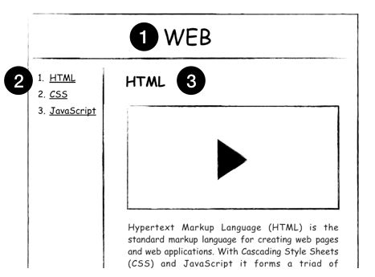

# 190529 HTML & Internet



무엇인가 만들기 전에 미리 계획해보는 과정이 필요하다.


### 기본 문법 - 태그 

<strong> : 강조

<u> :  밑줄

<h1>~<h6> : 제목 태그

<br>: 줄바꿈태그

<p> : 단락을 표시할 수 있음(의미론적으로 표현해줄수있음.)
<a> : 링크


```
시각장애가 있는 사람은
스크린리더(screen reader)와 같은 프로그램을 이용해서
정보를 청각화해서 접하게 됩니다.

그런데
웹페이지를 예쁘게 하기 위해서
HTML을 사용하지 않고
웹페이지 전체를 이미지로 만든다면
시각 장애가 있는 분들에게는
암흑과도 같은 상태가 됩니다.

자신도 모르는 사이에 누군가를 소외시키고 있는 것입니다.

반대로,
HTML을 의미론적으로 잘 사용한다면
자신도 모르는 사이에 누군가에게 정말 큰 도움을 주고 있는 것입니다.

이렇게
HTML은
비즈니스적인 측면에서도 중요하지만,
휴머니즘적인 측면에서도 중요한 기술입니다.
```

https://www.w3.org/TR/html5/

html 기술서

